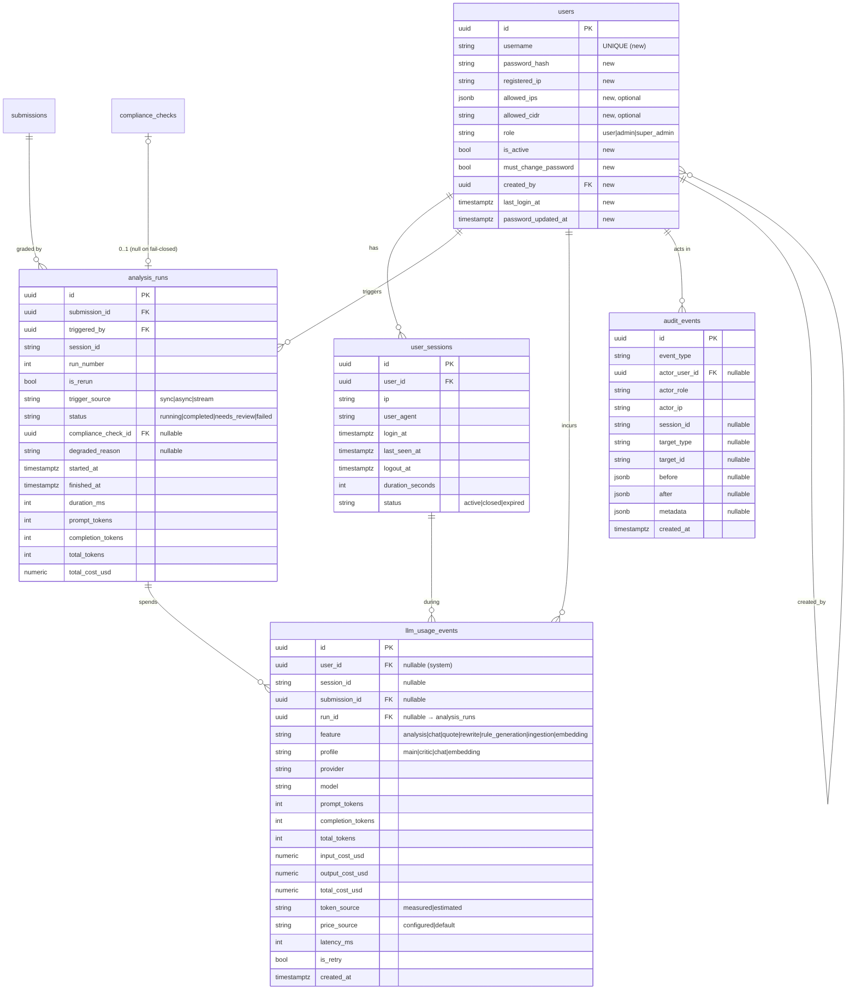

# 04 · Database Schema & Migrations

All schema changes are additive and follow the project's existing conventions: **UUID PKs**, `timezone=True` timestamps with
`server_default=func.now()`, **JSONB** for flexible blobs, and **Alembic-owned schema** (never `create_all` — see
`main.py:22-33`). Migrations continue the numbering from the current head **`0013_document_comparisons`**.

---

## 1. Entity-relationship additions



---

## 2. `users` — ALTER (migration `0014`)

Extend the existing table (do **not** drop the `firebase_uid`/`email` columns — leave them nullable for future SSO).

```sql
ALTER TABLE users
  ADD COLUMN username             VARCHAR(150),
  ADD COLUMN password_hash        VARCHAR(255),
  ADD COLUMN registered_ip        VARCHAR(64),
  ADD COLUMN allowed_ips          JSONB,
  ADD COLUMN allowed_cidr         VARCHAR(64),
  ADD COLUMN is_active            BOOLEAN NOT NULL DEFAULT TRUE,
  ADD COLUMN must_change_password BOOLEAN NOT NULL DEFAULT TRUE,
  ADD COLUMN created_by           UUID REFERENCES users(id) ON DELETE SET NULL,
  ADD COLUMN last_login_at        TIMESTAMPTZ,
  ADD COLUMN password_updated_at  TIMESTAMPTZ;

CREATE UNIQUE INDEX ix_users_username ON users (username) WHERE username IS NOT NULL;

-- Widen the role check if you add a DB-level constraint (optional; app enforces too):
-- ALTER TABLE users ADD CONSTRAINT ck_users_role CHECK (role IN ('user','admin','super_admin'));
```

- `email` becomes optional in practice (login is by `username`); keep it for display/notifications.
- Existing rows (if any) get `is_active=true`, `must_change_password=true`; they cannot log in until a `username` +
  `password_hash` are set by the seed script / an admin.

SQLAlchemy model change (`backend/app/models/user.py`) — add the columns and a `sessions` relationship. Keep the existing
`submissions` / `created_rules` relationships.

## 3. `user_sessions` (migration `0015`)

```sql
CREATE TABLE user_sessions (
    id               UUID PRIMARY KEY DEFAULT gen_random_uuid(),
    user_id          UUID NOT NULL REFERENCES users(id) ON DELETE CASCADE,
    ip               VARCHAR(64),
    user_agent       VARCHAR(400),
    login_at         TIMESTAMPTZ NOT NULL DEFAULT now(),
    last_seen_at     TIMESTAMPTZ,
    logout_at        TIMESTAMPTZ,
    duration_seconds INTEGER,
    status           VARCHAR(20) NOT NULL DEFAULT 'active'   -- active|closed|expired
);
CREATE INDEX ix_user_sessions_user     ON user_sessions (user_id, login_at DESC);
CREATE INDEX ix_user_sessions_status   ON user_sessions (status);
```

> Redis holds the *hot* session (`session:{sid}`) for auth; `user_sessions` is the *durable* record for session-time reporting.
> `id` here is the server session id (the `sid`) so Redis and Postgres line up.

## 4. `analysis_runs` (migration `0015`)

```sql
CREATE TABLE analysis_runs (
    id                  UUID PRIMARY KEY DEFAULT gen_random_uuid(),
    submission_id       UUID NOT NULL REFERENCES submissions(id) ON DELETE CASCADE,
    triggered_by        UUID REFERENCES users(id) ON DELETE SET NULL,
    session_id          VARCHAR(64),
    run_number          INTEGER NOT NULL,
    is_rerun            BOOLEAN NOT NULL DEFAULT FALSE,
    trigger_source      VARCHAR(16) NOT NULL DEFAULT 'sync',   -- sync|async|stream
    status              VARCHAR(20) NOT NULL DEFAULT 'running', -- running|completed|needs_review|failed
    compliance_check_id UUID REFERENCES compliance_checks(id) ON DELETE SET NULL,  -- NULL on fail-closed
    degraded_reason     VARCHAR(64),
    started_at          TIMESTAMPTZ NOT NULL DEFAULT now(),
    finished_at         TIMESTAMPTZ,
    duration_ms         INTEGER,
    prompt_tokens       INTEGER NOT NULL DEFAULT 0,
    completion_tokens   INTEGER NOT NULL DEFAULT 0,
    total_tokens        INTEGER NOT NULL DEFAULT 0,
    total_cost_usd      NUMERIC(12,6) NOT NULL DEFAULT 0
);
CREATE INDEX ix_analysis_runs_submission ON analysis_runs (submission_id, run_number);
CREATE INDEX ix_analysis_runs_user       ON analysis_runs (triggered_by, started_at DESC);
CREATE INDEX ix_analysis_runs_started    ON analysis_runs (started_at DESC);
```

## 5. `llm_usage_events` (migration `0015`)

```sql
CREATE TABLE llm_usage_events (
    id               UUID PRIMARY KEY DEFAULT gen_random_uuid(),
    user_id          UUID REFERENCES users(id) ON DELETE SET NULL,     -- NULL = system/ingestion
    session_id       VARCHAR(64),
    submission_id    UUID REFERENCES submissions(id) ON DELETE SET NULL,
    run_id           UUID REFERENCES analysis_runs(id) ON DELETE SET NULL,
    feature          VARCHAR(32) NOT NULL,      -- analysis|chat|quote|rewrite|rule_generation|ingestion|embedding
    profile          VARCHAR(16),               -- main|critic|chat|embedding
    provider         VARCHAR(32),
    model            VARCHAR(128),
    prompt_tokens    INTEGER NOT NULL DEFAULT 0,
    completion_tokens INTEGER NOT NULL DEFAULT 0,
    total_tokens     INTEGER NOT NULL DEFAULT 0,
    input_cost_usd   NUMERIC(12,6) NOT NULL DEFAULT 0,
    output_cost_usd  NUMERIC(12,6) NOT NULL DEFAULT 0,
    total_cost_usd   NUMERIC(12,6) NOT NULL DEFAULT 0,
    token_source     VARCHAR(12) NOT NULL DEFAULT 'measured',  -- measured|estimated
    price_source     VARCHAR(12) NOT NULL DEFAULT 'configured',-- configured|default
    latency_ms       INTEGER,
    is_retry         BOOLEAN NOT NULL DEFAULT FALSE,
    created_at       TIMESTAMPTZ NOT NULL DEFAULT now()
);
CREATE INDEX ix_usage_user_created ON llm_usage_events (user_id, created_at DESC);
CREATE INDEX ix_usage_submission   ON llm_usage_events (submission_id);
CREATE INDEX ix_usage_run          ON llm_usage_events (run_id);
CREATE INDEX ix_usage_model        ON llm_usage_events (model, created_at);
CREATE INDEX ix_usage_created      ON llm_usage_events (created_at);
```

> **Scale note.** This is the highest-volume new table (one row per billed LLM call — a single analysis of a long document can be
> dozens of rows). Indexes above serve the console rollups. If volume becomes large, add monthly range **partitioning** on
> `created_at` and/or a nightly rollup into a `usage_daily` summary table. Not needed at UAT scale.

## 6. `audit_events` (migration `0016`)

```sql
CREATE TABLE audit_events (
    id             UUID PRIMARY KEY DEFAULT gen_random_uuid(),
    event_type     VARCHAR(48) NOT NULL,
    actor_user_id  UUID REFERENCES users(id) ON DELETE SET NULL,
    actor_role     VARCHAR(20),
    actor_ip       VARCHAR(64),
    session_id     VARCHAR(64),
    target_type    VARCHAR(24),
    target_id      VARCHAR(64),
    before         JSONB,
    after          JSONB,
    metadata       JSONB,
    created_at     TIMESTAMPTZ NOT NULL DEFAULT now()
);
CREATE INDEX ix_audit_type_created   ON audit_events (event_type, created_at DESC);
CREATE INDEX ix_audit_actor_created  ON audit_events (actor_user_id, created_at DESC);
CREATE INDEX ix_audit_target         ON audit_events (target_type, target_id);

-- Append-only enforcement (see 08 — run under the migration/owner role):
CREATE OR REPLACE FUNCTION audit_events_no_mutate() RETURNS trigger AS $$
BEGIN RAISE EXCEPTION 'audit_events is append-only'; END; $$ LANGUAGE plpgsql;
CREATE TRIGGER trg_audit_events_no_update BEFORE UPDATE OR DELETE ON audit_events
  FOR EACH ROW EXECUTE FUNCTION audit_events_no_mutate();
```

## 7. Optional: `model_prices` (Decision D6 alternative)

If finance should edit rates without a redeploy, replace the config map with a table the console can edit:

```sql
CREATE TABLE model_prices (
    model            VARCHAR(128) PRIMARY KEY,
    input_per_1k     NUMERIC(12,6) NOT NULL DEFAULT 0,
    output_per_1k    NUMERIC(12,6) NOT NULL DEFAULT 0,
    currency         VARCHAR(8) NOT NULL DEFAULT 'USD',
    updated_by       UUID REFERENCES users(id),
    updated_at       TIMESTAMPTZ NOT NULL DEFAULT now()
);
```

`compute_cost` then reads this table (cached, invalidated on edit) instead of `settings.llm_prices`.

## 8. Migration plan (Alembic)

Continue from head `0013`. Each migration has a working `downgrade()` (drop the added objects). All columns are nullable or
defaulted → **zero-downtime, no backfill** (matching how `0009`/`0010` were done).

| Rev | File | Contents |
|-----|------|----------|
| `0014` | `0014_auth_users.py` | `users` ALTER (username, password_hash, ip fields, is_active, must_change_password, created_by, timestamps) + unique username index |
| `0015` | `0015_usage_monitoring.py` | `user_sessions`, `analysis_runs`, `llm_usage_events` + indexes |
| `0016` | `0016_audit_events.py` | `audit_events` + append-only trigger + indexes |
| `0017` | `0017_model_prices.py` *(optional)* | `model_prices` (only if D6-alt chosen) |

Apply order is linear (`0014 → 0015 → 0016`). The backend Dockerfile already runs `alembic upgrade head` at container start, so
deploying the new image migrates automatically (README §Quick Start).

## 9. Model registration

Add the new models to `backend/app/models/__init__.py` and to the import block in `main.py` lifespan (the same place
`DocumentComparison` was added) so SQLAlchemy registers them on `Base.metadata` for Alembic autogenerate parity:

```python
from .user_session import UserSession
from .analysis_run import AnalysisRun
from .llm_usage_event import LlmUsageEvent
from .audit_event import AuditEvent
```
