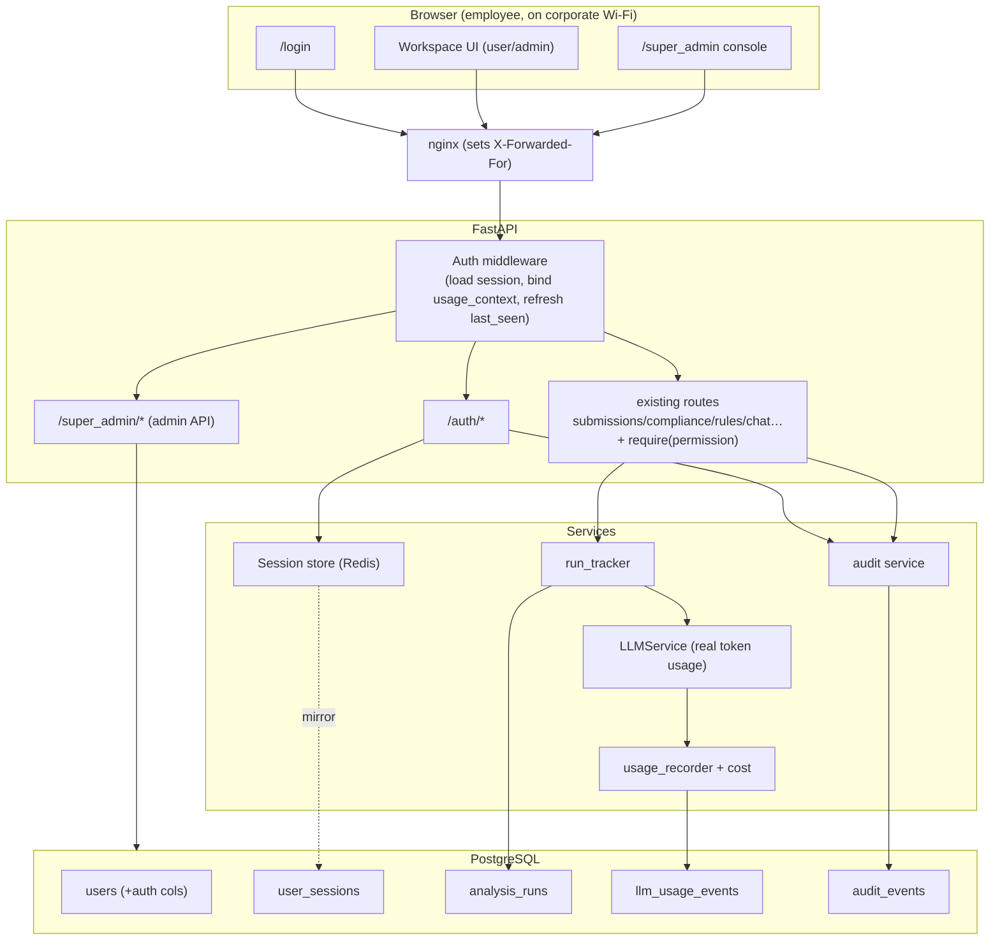
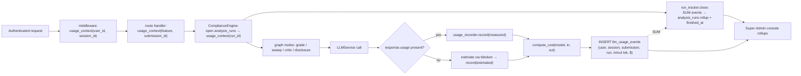
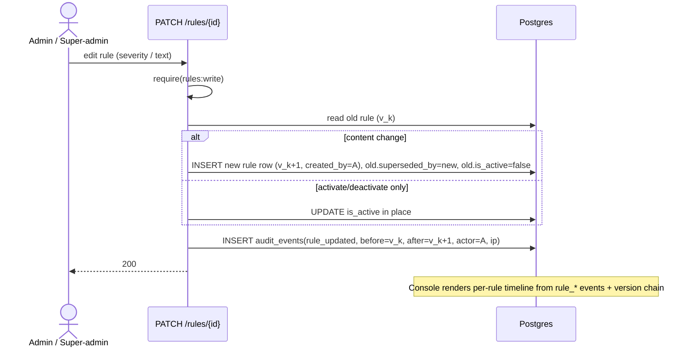
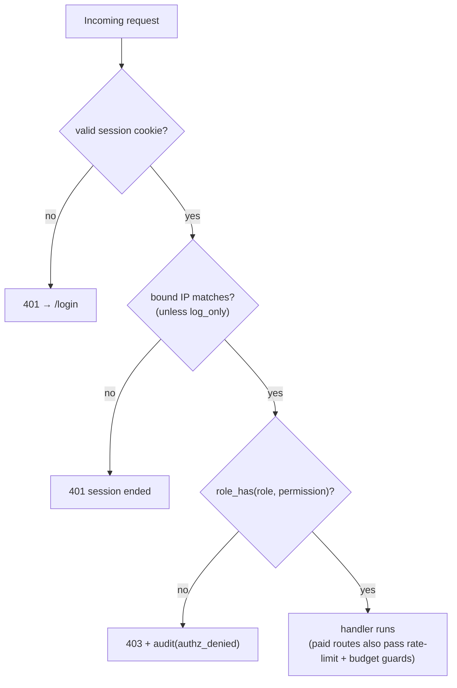
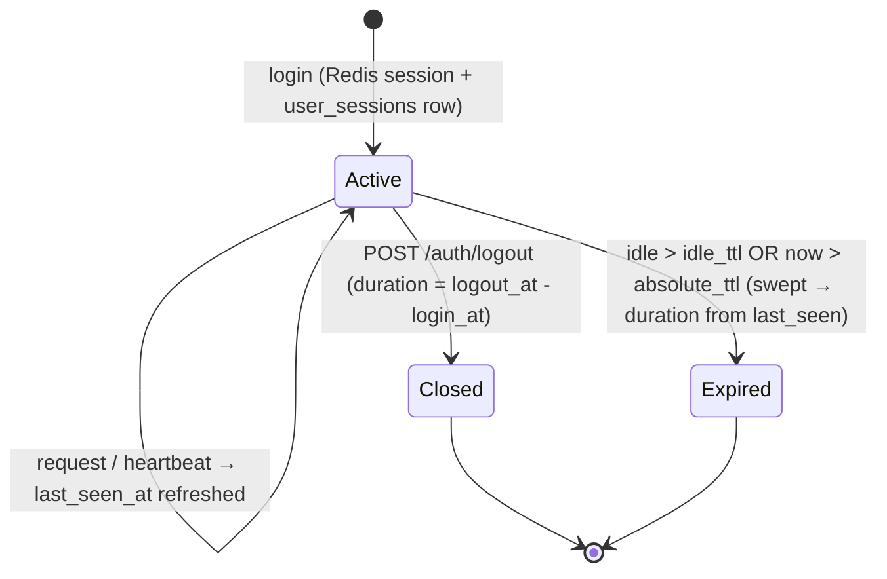
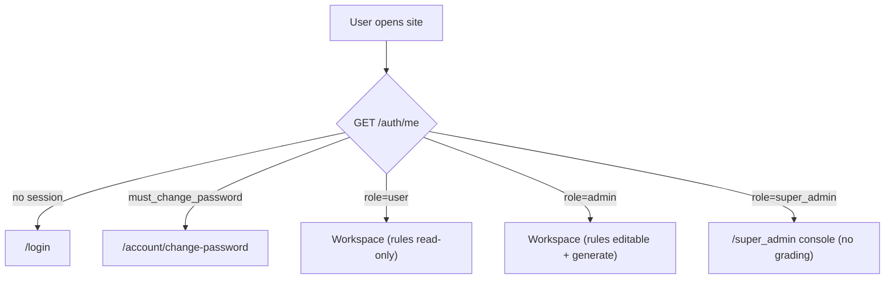

# 07 · Workflow Diagrams

Mermaid diagrams for every flow in this plan. (GitHub, VS Code Mermaid preview, and most Markdown viewers render these.)

---

## 1. System context — where the new pieces sit



---

## 2. Login (three-factor: username + password + IP)

```mermaid
sequenceDiagram
    actor U as User
    participant FE as Frontend (/login)
    participant NX as nginx
    participant API as /auth/login
    participant DB as Postgres
    participant R as Redis
    U->>FE: username + password (NOT ip)
    FE->>NX: POST /auth/login
    NX->>API: + X-Forwarded-For: real client ip
    API->>DB: get user by username
    alt not found / inactive / bad password
        API->>DB: INSERT audit_events(login_failed)
        API-->>FE: 401 invalid credentials
    else IP not allowed (strict mode)
        API->>DB: INSERT audit_events(login_failed, ip_mismatch)
        API-->>FE: 403 "ask an admin to update your IP"
    else success
        API->>R: SET session:{sid} bound to (user,ip,ua)
        API->>DB: INSERT user_sessions(login_at)
        API->>DB: INSERT audit_events(login)
        API-->>FE: 200 {role, must_change_password} + Set-Cookie rca_session (httpOnly)
    end
    FE->>FE: route by role (super_admin→/super_admin, else →/); force pw change if needed
```

---

## 3. User provisioning (admin/super-admin creates an account)

```mermaid
sequenceDiagram
    actor A as Admin / Super-admin
    participant FE as Console › Users
    participant API as POST /super_admin/users
    participant DB as Postgres
    A->>FE: username, temp password, registered IP, role
    FE->>API: create user (session cookie)
    API->>API: require(users:manage) ; admin may create role=user only
    API->>DB: INSERT users(password_hash, registered_ip, is_active, must_change_password=true, created_by=A)
    API->>DB: INSERT audit_events(user_created, after={username,role,ip})
    API-->>FE: 201 created
    Note over A,DB: First login forces password change → must_change_password=false
```

---

## 4. Token & cost capture (the money pipeline)



Key property: **every billed call** (including failover retries and schema-correction retries) writes its own event, so the
per-document/per-user/per-run cost reflects real spend — not a single "happy path" estimate.

---

## 5. Re-run tracking

```mermaid
sequenceDiagram
    actor U as User
    participant API as /compliance/analyze/{id}
    participant RT as run_tracker
    participant DB as Postgres
    U->>API: analyze (again) submission X
    API->>API: require(analysis:run)
    API->>RT: open(submission=X, user=U, source=stream)
    RT->>DB: run_number = count(analysis_runs where submission=X)+1
    RT->>DB: INSERT analysis_runs(run_number=n, is_rerun=(n>1), status=running)
    RT->>DB: INSERT audit_events(analysis_started [+ analysis_rerun if n>1])
    Note over API: graph runs; LLM calls attributed to this run_id
    alt run persists a grade
        API->>DB: ComplianceCheck + Violations (status=analyzed)
        RT->>DB: close: status=completed, link check_id, SUM tokens/cost
    else fail-closed (needs_review/failed) — NO ComplianceCheck
        RT->>DB: close: status=needs_review, check_id=NULL, degraded_reason, SUM tokens/cost
    end
    RT->>DB: INSERT audit_events(analysis_finished, cost)
```

> The fail-closed branch is why runs are tracked separately from `compliance_checks`: **no grade persisted, but tokens still
> spent and fully costed.**

---

## 6. Rule change → audit (who changed what)



---

## 7. RBAC decision (per request)



---

## 8. Session lifecycle & time tracking



---

## 9. Role → surface routing (frontend)


