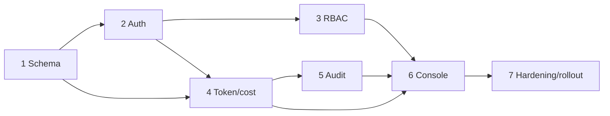

# 09 · Implementation Roadmap

A phased plan so the system stays shippable at every step. Each phase is independently testable and leaves `main` deployable.
Sequencing respects data dependencies (schema → capture → surface).

---

## Phase 0 — Decisions & prep (½ day)

- Resolve the open decisions from [00 §7](./00-overview-goals-scope.md): **D1** IP-binding mode, **D2** session mechanism,
  **D3** who provisions, **D4** super-admin grading (no), **D5** password reset, **D6** price source, **D7** backfill (no).
- Fill the **price table** from the actual Azure/Groq/Cohere contract.
- Confirm nginx sets a sanitized client-IP header and TLS is terminated in the UAT deploy.

**Exit:** decisions recorded in this doc; `.env.prod.example` updated with `AUTH_*`, `SUPER_ADMIN_*`, `LLM_PRICE_*`,
`TRUST_FORWARDED_FOR=true`.

---

## Phase 1 — Schema & models (1 day)

- Alembic `0014` (users ALTER), `0015` (user_sessions, analysis_runs, llm_usage_events), `0016` (audit_events + trigger).
- New SQLAlchemy models + registration in `models/__init__.py` and `main.py` lifespan.
- Seed script `seed_super_admin.py`.

**Exit:** `alembic upgrade head` clean on a copy of the UAT DB; seed creates the first super-admin; no app behaviour change yet.

**Test:** migration up/down; model import smoke test (extends existing `tests/test_imports.py`).

---

## Phase 2 — Authentication & sessions (2 days)

- `auth/passwords.py`, `auth/sessions.py`, `auth/dependencies.py`, `auth/middleware.py`, `api/routes/auth.py`.
- Login/logout/me/heartbeat/change-password; login lockout; IP binding per chosen mode.
- Frontend: `middleware.ts`, `/login`, `/account/change-password`, `AuthProvider`, `getMe`, `credentials:"include"` on fetches.
- Turn on the workspace layout guard (redirect unauth → `/login`).

**Exit:** you must log in to use the app; sessions are created and time-tracked; bad creds / wrong IP / lockout behave per
[01 §5](./01-auth-rbac-design.md).

**Test:** `tests/auth/*` (passwords, ip-binding matrix, auth routes); manual: login, logout, wrong IP, lockout, Redis-down = 503.

---

## Phase 3 — RBAC enforcement (1 day)

- `auth/permissions.py` + `require(permission)` on **every** existing route (submissions, compliance, chat, rules, dashboard,
  comparisons, knowledge-base).
- Frontend role gating: hide rule-mutation UI for `user`; route `super_admin` away from the workspace; hide/disable Generate.

**Exit:** a `user` gets 403 on rule mutations and `/super_admin/*`; an `admin` can edit rules; a `super_admin` cannot grade.

**Test:** `tests/auth/test_rbac_matrix.py` (full role × permission grid); manual cross-role probing per [08 §11](./08-security-hardening.md).

---

## Phase 4 — Token/cost capture (2 days) ← the primary goal

- `services/observability/usage_context.py`, `usage_recorder.py`, `cost.py`; hook into `LLMService` at the existing
  `usage`-read points (non-stream + stream); embeddings capture.
- `services/run_tracker.py`; wire `open/close` into `ComplianceEngine.analyze_submission` (set `usage_context(run_id)`),
  covering the **fail-closed** path.
- `audit.record` for `analysis_started/rerun/finished`, `feedback_submitted`, `submission_created/deleted`.

**Exit:** every analysis/chat/rewrite/rule-generation call writes an attributed `llm_usage_events` row with cost; each run
(incl. re-runs and degraded runs) is an `analysis_runs` row with token/cost rollups.

**Test:** `tests/observability/test_cost.py`, `test_usage_context.py` (ContextVar across `asyncio.gather`),
`tests/services/test_run_tracker.py` (**fail-closed run still costed** — the critical case); manual: run + re-run a doc, confirm
two runs with distinct costs.

---

## Phase 5 — Rule-change & user audit (½ day)

- `audit.record` for `rule_created/updated/activated/deactivated/deleted`, `rules_generated`, and all `user_*` events (before/
  after snapshots).

**Exit:** editing a rule produces a `rule_updated` event with actor + before/after; the version chain + events give a full
timeline.

**Test:** update a rule as admin and as super-admin → two audited events with correct `actor_role`.

---

## Phase 6 — Super-Admin console (3 days)

- Backend `api/routes/admin_console.py` (users, usage summary, by-document, timeseries, runs, sessions, audit, rules-audit,
  CSV export).
- Frontend `(super-admin)/super_admin/*` pages (Overview, Users, Usage & Cost, Runs, Sessions, Audit, Rules) with the tables/
  charts from [06 §6](./06-frontend-implementation.md).
- User provisioning UI (create/edit/reset/force-logout).

**Exit:** a super-admin, at `…/super_admin`, sees per-user and per-document token/cost, re-runs, session time, the audit feed,
and who changed which rule — and can provision users and (optionally) edit rules.

**Test:** `tests/api/test_admin_console.py` (auth + shapes); manual walkthrough of every console screen against seeded data.

---

## Phase 7 — Hardening & rollout (1–2 days)

- CSRF tokens, CORS lockdown, security headers, TLS/HSTS at nginx, sanitized client-IP header, append-only DB role, per-user
  rate-limit keying, cost alerts.
- Redaction denylist updates; verbose logging off in prod.
- Full [08 §12](./08-security-hardening.md) checklist; a short internal pen-test pass.

**Exit:** checklist green; deploy to UAT; provision real accounts; monitor.

---

## Effort summary

| Phase | Focus | Est. |
|-------|-------|------|
| 0 | Decisions & prep | 0.5d |
| 1 | Schema & models | 1d |
| 2 | Auth & sessions | 2d |
| 3 | RBAC | 1d |
| 4 | **Token/cost capture** | 2d |
| 5 | Audit (rules/users) | 0.5d |
| 6 | Super-Admin console | 3d |
| 7 | Hardening & rollout | 1.5d |
| | **Total** | **~11.5 days** (1 engineer; parallelize FE/BE to compress) |

---

## Dependency order (what blocks what)

---

## Acceptance criteria (definition of done)

1. Visiting the site unauthenticated → `/login`; no feature is reachable without a session.
2. Accounts are created by an admin/super-admin with **username + password + IP**; login checks all three; session is IP-bound.
3. `user` can grade + view dashboards but **cannot** change rules or reach `/super_admin`; `admin` can change rules;
   `super_admin` sees the **console only** and cannot grade.
4. The super-admin console shows, per user and **per document**, **input tokens, output tokens, and cost**, plus **re-runs** and
   **session time** — including runs that failed closed (spent tokens, produced no grade).
5. Every rule change records **who changed what** (actor + before/after), viewable in the console.
6. The audit log is append-only; auth fails closed when Redis is down; the [08](./08-security-hardening.md) checklist is green.

---

## Rollback & safety

- Every migration has a working `downgrade()`; all new columns are nullable/defaulted → Phase 1 is reversible with no data loss
  to existing tables.
- Auth can be feature-flagged (`AUTH_ENABLED`) to fall back to open access during a controlled cutover window (dev/UAT only —
  never leave it off in a shared environment).
- Token capture is best-effort and never blocks grading, so Phase 4 cannot break the core product even if the ledger errors.

---

## Backfill note (D7)

Monitoring starts at go-live. Historical runs lack per-user attribution (there was no auth), so we do **not** backfill
`llm_usage_events`. If a rough historical cost is wanted, a one-off script can approximate from the existing
`agent_executions.total_tokens_used` with `user_id = NULL` and `token_source = "estimated"`, clearly labelled as pre-auth
estimates.
