# Regulatory Compliance Agent — System Architecture

> Marketing-content compliance review for Bajaj Life. A document is pasted or uploaded,
> the system grades it against historical reviewer decisions and regulatory rules, and
> returns scored violations the user can interrogate via chat.
>
> **Core principle:** the engine never decides from raw model knowledge. Every finding is
> grounded in retrieved evidence — a past reviewer decision (precedent), an active rule, or
> expert judgment that must clear a high confidence bar. Anything it cannot evaluate fails
> closed to human review; nothing is ever silently graded clean.

---

## 1. System Overview

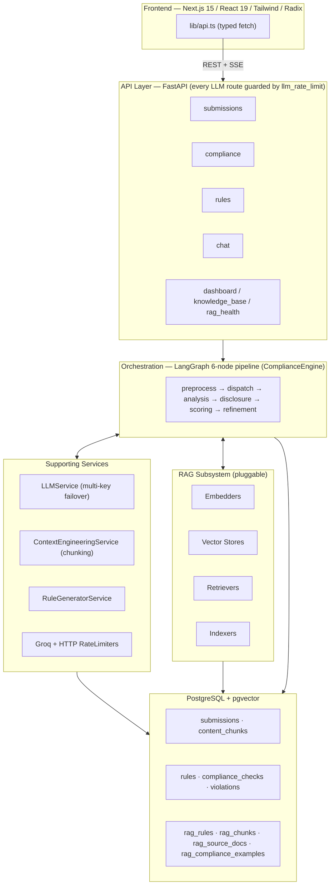

The compliance engine is orchestrated as a **linear LangGraph state machine**. The RAG
subsystem supplies the evidence each tier needs. The data layer keeps everything
audit-traceable (versioned rules, citation locators, a suppressed-finding lane).

---

## 2. The Analysis Pipeline (LangGraph)

`ComplianceEngine.analyze_submission(submission_id, db)` (`engine.py:73`) claims the
submission under a row lock, runs the graph to `END`, then applies a **fail-closed
persistability gate** before writing anything.

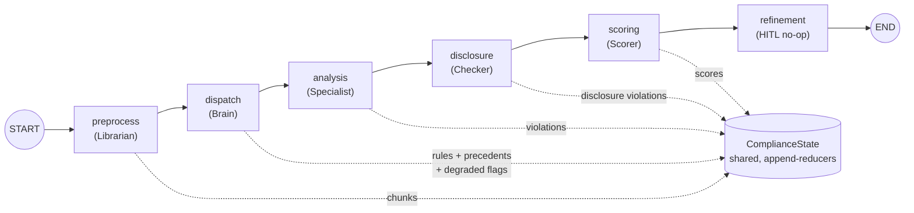

| Node | Role | What it does | LLM calls |
|------|------|--------------|-----------|
| **preprocess** | Librarian | Section-aware chunking; mirrors chunks into `rag_chunks` (non-fatal) | 0 |
| **dispatch** | Brain | Loads active rules (fail-closed); per-chunk RAG retrieval of **rules** + **precedents**; enriches rules with regulator quotes; sets degradation flags | 0 |
| **analysis** | Specialist | Grades each chunk in parallel — **three-tier grounding** + completeness sweep + critic + dedup | 1–2 / chunk |
| **disclosure** | Checker | Deterministically verifies mandated disclaimers (`backend/app/services/disclaimer/`) against the registry in `backend/data/disclaimers/` | 0 |
| **scoring** | Scorer | Absolute-deduction score, critical fail-cap, per-category subscores, grade + status | 0 |
| **refinement** | HITL | No-op passthrough — graph runs straight through so analysis completes in one call | 0 |

State flows forward via a shared `ComplianceState` TypedDict (`graph/state.py`); `violations`,
`active_agents`, and `messages` use `Annotated[..., operator.add]` reducers so node outputs
append. DB sessions reach nodes through a `ContextVar` (`graph/context.py`), not serialized state.

### Engine wrapper (fail-closed gate)

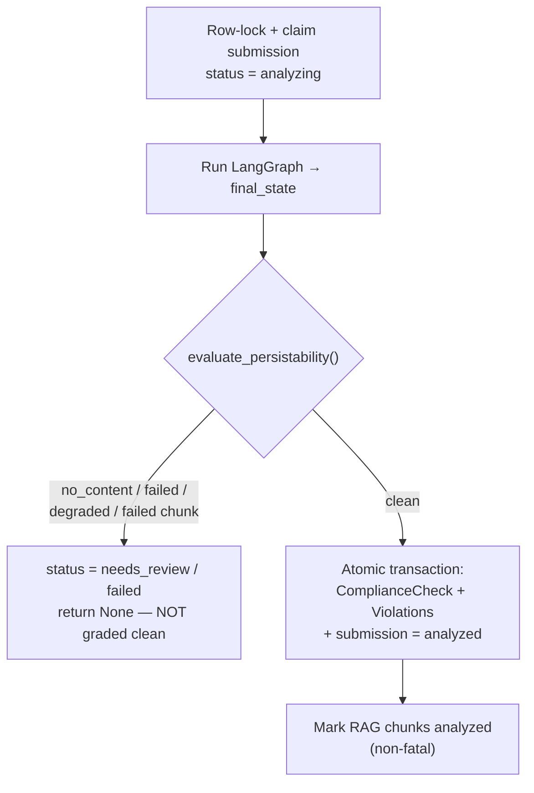

---

## 3. The Engines and How They Work Together

The "analysis node" is really **three grounding engines feeding one consolidation
stage**. A single LLM call per chunk (temperature 0, structured output
`PrecedentCitationsResult`) emits findings into all three lanes at once; the engines differ
in *what evidence backs them* and *how their output is mapped to a violation*.

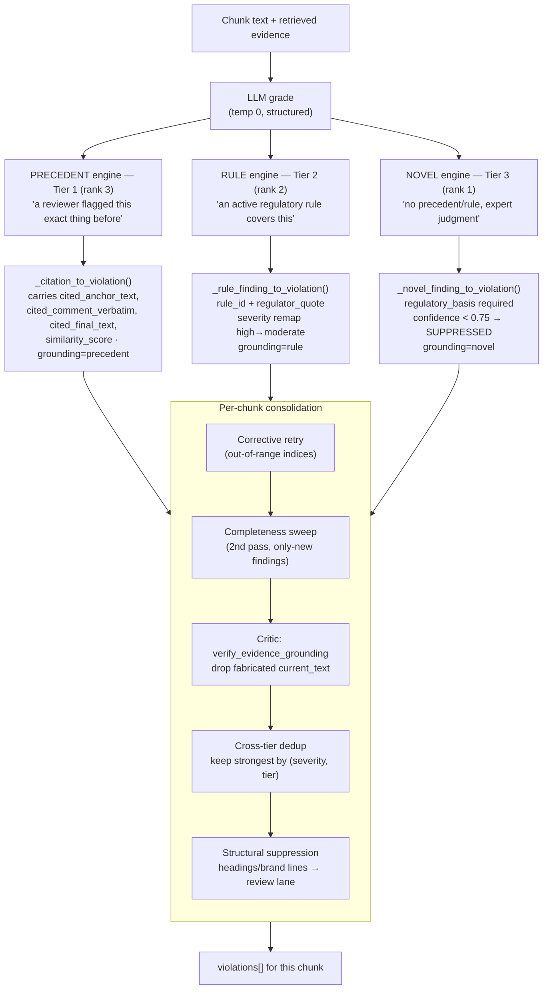

### Why three tiers, ranked

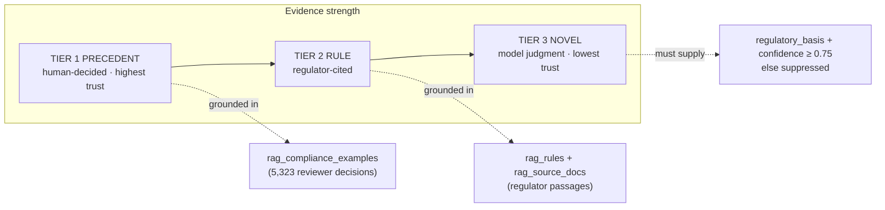

When precedent, rule, and novel all flag the **same phrase**, cross-tier dedup keeps the
strongest: `precedent (3) > rule (2) > novel (1)`, then by severity rank. Structural
false-positives (headings, brand lines) are *suppressed, not dropped* — persisted to an
auditable review lane and kept out of scoring.

### 3a. Precedent Engine

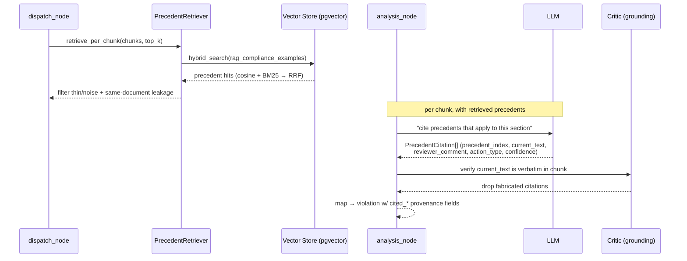

The precedent engine is the strongest tier because each finding is anchored to a *real past
reviewer decision* — it carries the original reviewer's comment, the approved rewrite, and a
similarity score, all persisted on the violation for audit.

### 3b. Rule Engine

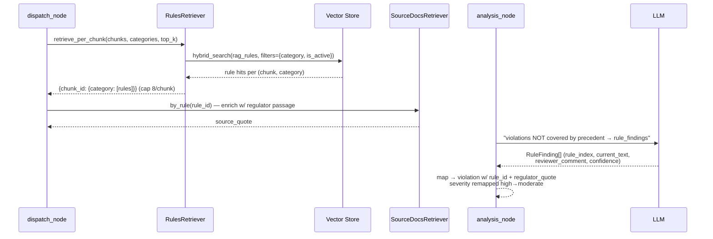

Rule findings cover the regulatory ground precedents miss. Severity is remapped
conservatively (`high → moderate`) so rule findings don't inflate the critical count that
drives the fail-closed cap. On RAG failure the dispatch node falls back to the full active-rule
set and flags `rag_degraded`.

### 3c. Novel Engine

The last resort: the LLM may only emit a novel finding when **no precedent and no rule
covers it**. It must supply a `regulatory_basis` and clear the `NOVEL_CONFIDENCE_FLOOR = 0.75`.
Anything below the floor is persisted with `suppressed=True` + reason, kept out of the score,
and routed to a human. Hard-coded `severity=moderate`, `category=regulatory`.

---

## 4. RAG Subsystem

A protocol-driven, multi-backend retrieval platform. Two abstractions in `rag/ports.py`
(`Embedder`, `VectorStore`) make backends swappable **by environment variable only** — this is
the pgvector-v1 → Azure-AI-Search-v2 roadmap materialized.

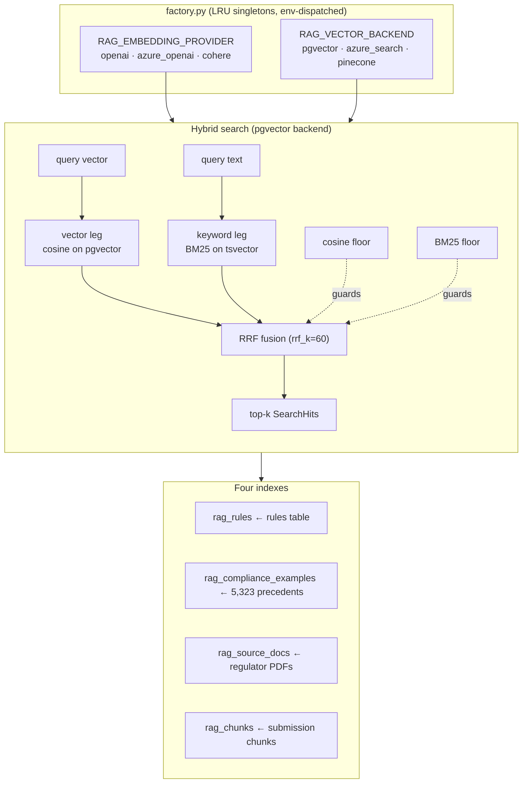

- **Embedding-model safety:** every upsert stamps `embedding_model`/`embedding_dim`; query
  time validates the corpus matches the active embedder and raises `RAGDegraded` on mismatch
  (guards silent cosine corruption).
- **Two quality floors** (cosine + BM25) prevent hallucinated grounding from spurious lexical
  matches.
- **Retrievers** (all async, parallelized via `asyncio.gather`): `PrecedentRetriever`,
  `RulesRetriever`, `ChatRetriever` (3-way + violation linking), `SourceDocsRetriever`,
  `SimilarSubmissionsRetriever`.

---

## 5. Scoring and the Feedback Loop

`ScoringService.calculate_scores` (`scoring.py:36`) uses an **absolute-deduction** model that
is independent of category count:

```
overall = 100 − Σ( severity_weight(v) × reliability(rule) × confidence(v) )   clamp [0,100]

severity_weight:  critical=20  high=10  moderate=8  medium=5  low=2  informational=2
```

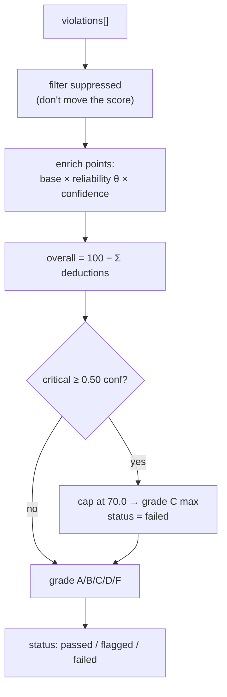

**Adaptive rule weights (HITL loop):** each rule's penalty is scaled by its Beta-Binomial
posterior mean `θ = α/(α+β)`, learned from reviewer accept/reject feedback. NULL counts → θ=1.0
(never under-penalize); floored at 0.30 (feedback discounts, never erases a rule).

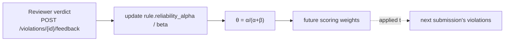

Reviewer *document* scores (`reviewer_score`) are stored for **evaluation only** and never
train the scorer.

---

## 6. Data Model

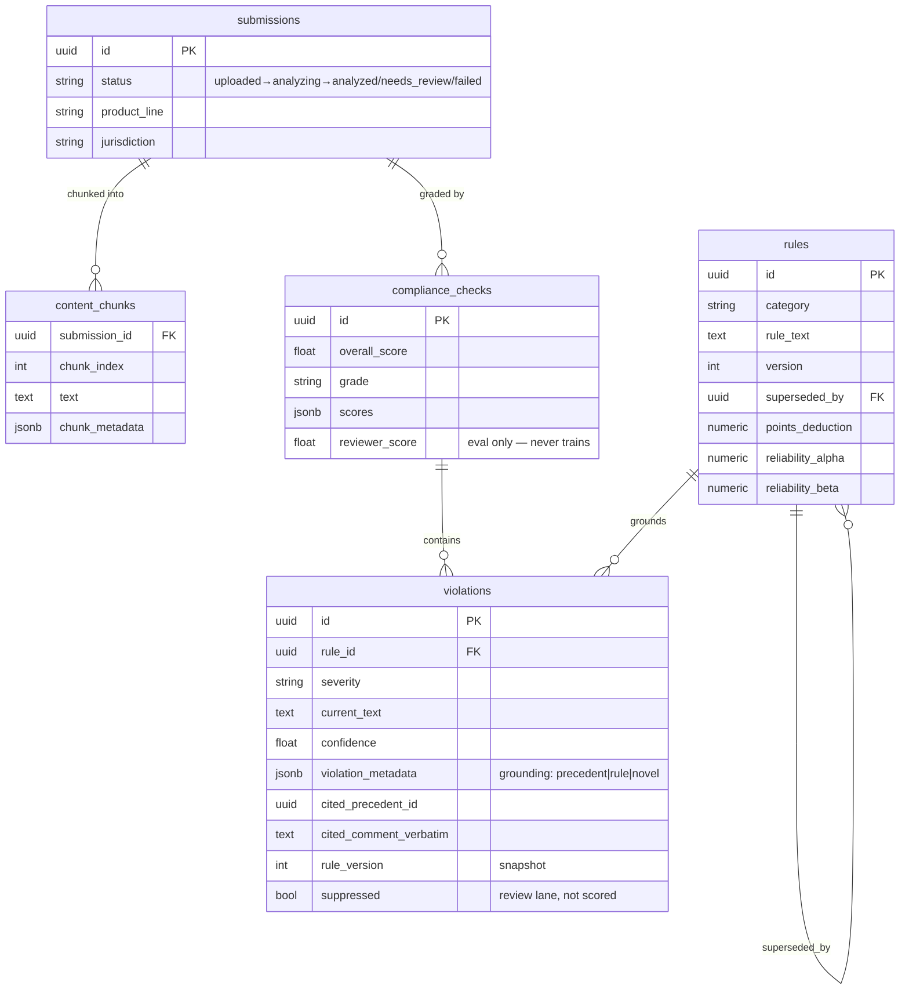

**Audit-defensibility is baked in:** rules are versioned not mutated (edits create a new row,
old `superseded_by` new); violations snapshot `rule_version` and citation locators
(`cited_section`/`cited_page`/`cited_regulation_version`); suppressed findings persist for review
rather than vanishing.

---

## 7. End-to-End Sequence

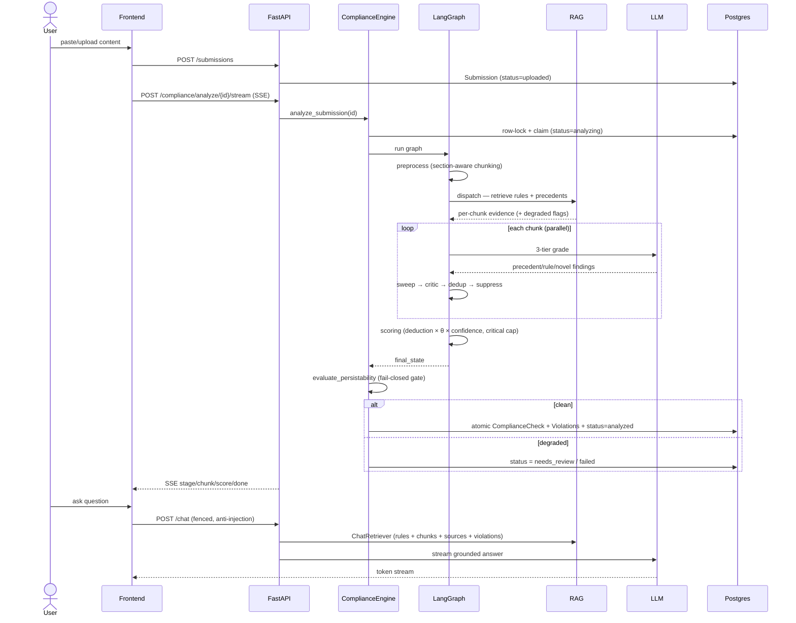

---

## 8. Cross-Cutting Principles

1. **Fail closed everywhere** — RAG degradation, LLM unavailability, rule-load failure,
   schema-validation failure, and any failed chunk all block persistence and route to human
   review. Nothing is silently graded clean.
2. **Evidence-grounded, not model-opinion** — three engines ranked by evidence strength; the
   critic deterministically rejects fabricated quotes.
3. **Pluggable RAG** — protocol abstractions let pgvector → Azure → Pinecone swap by env var.
4. **Audit-traceable** — versioned rules, citation locators, suppressed-finding lane,
   reviewer-score isolation.
5. **Adaptive but bounded** — reviewer feedback tunes rule weights via Beta-Binomial, floored
   so feedback can discount but never erase a rule.

---

## Appendix — Key Source Locations

| Concern | File |
|---------|------|
| Engine entry / fail-closed gate | `backend/app/services/agents/compliance/engine.py` |
| Graph nodes / 3-tier analysis | `backend/app/services/agents/graph/nodes.py` |
| Graph wiring | `backend/app/services/agents/orchestrator.py` |
| State / context | `backend/app/services/agents/graph/state.py`, `graph/context.py` |
| Scoring + reliability | `backend/app/services/agents/compliance/scoring.py`, `reliability.py` |
| Critic | `backend/app/services/agents/compliance/critic.py` |
| RAG ports / factory | `backend/app/services/rag/ports.py`, `rag/factory.py` |
| Vector stores | `backend/app/services/rag/stores/*.py` |
| Retrievers | `backend/app/services/rag/retrievers/*.py` |
| LLM service | `backend/app/services/llm_service.py` |
| Preprocessing / chunking | `backend/app/services/preprocessing_service.py` |
| Rule generation | `backend/app/services/rule_generator_service.py` |
| API routes | `backend/app/api/routes/*.py` |
| Data models | `backend/app/models/*.py` |
